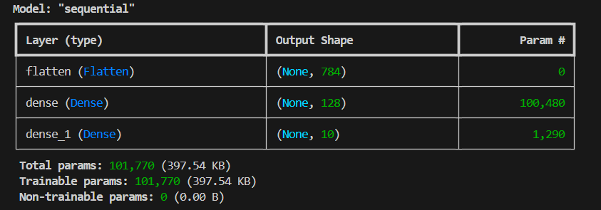
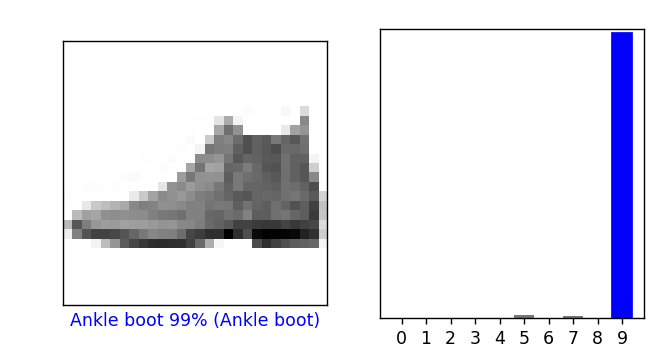
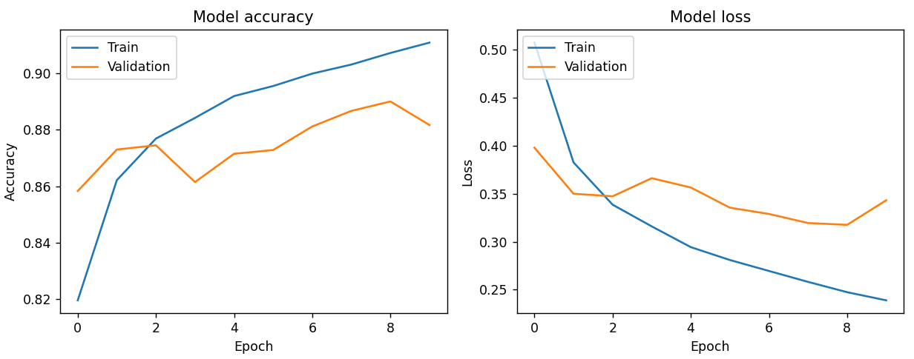

# MEng_classify_fashion_MNIST
classify fashion MNIST

Fashion MNIST Image Classifier

This project is a simple neural network designed to classify images of clothing from the Fashion MNIST dataset. It's built using Python and the TensorFlow/Keras library.

The main goal is to demonstrate the complete workflow of a basic image classification task, including:

Loading a dataset from local binary files.

Preprocessing the image data.

Building a sequential neural network.

Training the model.

Evaluating its performance on a test set.

Visualizing the results.

File Descriptions

fashion_mnist_classifier.py: This is the main Python script that contains all the code to run the project. It handles data loading, model creation, training, and evaluation.

Step_by_Step_Guide.md: A supplementary Markdown file that explains the logic and reasoning behind each code block in the main script.

data/: This directory is where the Fashion MNIST dataset files must be stored.

🚀 Getting Started: Setup Instructions

Follow these steps carefully to set up and run the project on your local machine.

Step 1: Clone the Repository

First, clone this repository to your computer using the following command in your terminal:

git clone <your-repository-url>
cd <your-repository-name>

Step 2: Create a Python Virtual Environment (Recommended)

It's a best practice to create a virtual environment to manage project dependencies and avoid conflicts with other projects.

Step 3: Install Required Libraries

The script depends on TensorFlow and Matplotlib. Install them using pip:

pip install tensorflow matplotlib

This will prevent the ModuleNotFoundError: No module named 'tensorflow' error.

Step 4: Download and Place the Dataset

The script is configured to load data from a local data folder.

If it doesn't already exist, create a folder named data in the main project directory.

Download the four gzipped ubyte files from the official Fashion MNIST GitHub repository.

Unzip the files and place them inside the data folder. Your folder structure must look exactly like this:

Your_Project_Folder/
├── fashion_mnist_classifier.py
└── data/
    ├── train-images-idx3-ubyte
    ├── train-labels-idx1-ubyte
    ├── t10k-images-idx3-ubyte
    └── t10k-labels-idx1-ubyte

Note: This is the most critical step. If the files are not in the correct location or named correctly, you will get a FileNotFoundError.

How to Run the Code

Once you have completed all the setup steps, running the project is simple. Make sure your virtual environment is activated and you are in the project's main directory. Then, run the following command in your terminal:

python fashion_mnist_classifier.py

Expected Output

When you run the script, you should see the following:

A summary of the model's architecture printed in the console.

The training progress for 10 epochs, showing the loss and accuracy for each epoch.

The final test accuracy printed in the console (it should be around 88-90%).

Two plot windows will appear:

The first shows a sample prediction on a test image.

The second shows the model's accuracy and loss history over the training epochs.

